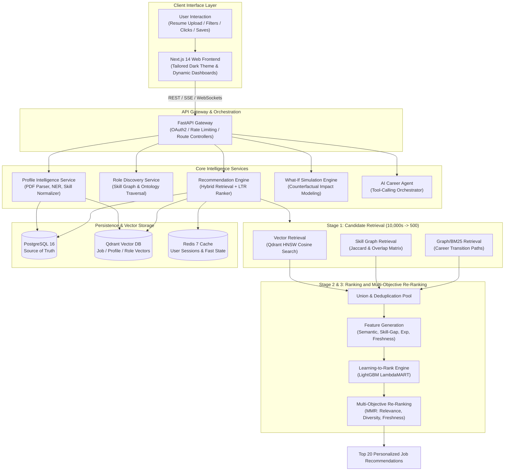
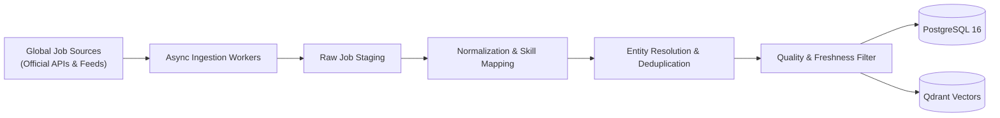
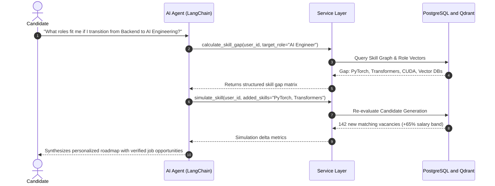
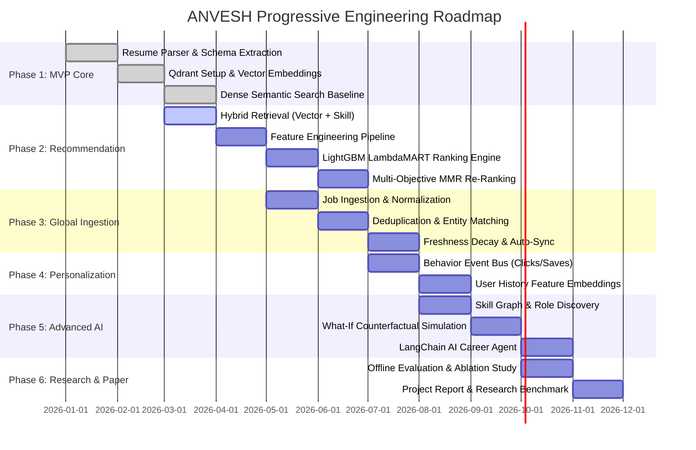

# 🚀 ANVESH (अन्वेष)
### AI-Powered Global Career Discovery & Multi-Stage Recommendation Platform

[](https://fastapi.tiangolo.com)
[](https://nextjs.org/)
[](https://qdrant.tech/)
[](https://www.postgresql.org/)
[](https://lightgbm.readthedocs.io/)
[](https://opensource.org/licenses/MIT)

---

## 📌 Architectural Manifesto

> **Core Architectural Principle:**
> $$\text{Resume} \longrightarrow \text{Candidate Intelligence} \longrightarrow \text{Role Discovery} \longrightarrow \text{Global Job Intelligence} \longrightarrow \text{Multi-Stage Recommendation} \longrightarrow \text{Personalized Career Intelligence}$$

**ANVESH** (*Sanskrit for "Discovery & Exploration"*) is an enterprise-grade AI career intelligence and recommendation platform designed for deep discovery, transparent recommendation, skill graph intelligence, and counterfactual upskilling simulations.

Instead of treating job search as a brittle keyword query or a black-box LLM prompt, ANVESH decomposes career intelligence into a **deterministic, multi-stage hybrid recommendation pipeline** coupled with a **tool-augmented autonomous AI Agent**.

---

## 🏛️ System Architecture Topology



---

## 💎 Core Architectural Pillars

### 1. 🧠 Profile Intelligence Service
- **Deterministic & Semantic Parsing**: Ingests multi-format resumes (PDF, DOCX) extracting verified experience, education history, projects, and domain proficiencies without LLM hallucinations.
- **Skill Normalization & Canonicalization**: Maps arbitrary skill variants (e.g., *\"k8s\"*, *\"Kubernetes\"*, *\"K8s Orchestration\"*) into unique canonical ontology nodes in `skills.json`.
- **Dense Vector Encoding**: Generates 384-dimensional profile embeddings using `sentence-transformers/all-MiniLM-L6-v2` indexing both current skill state and career trajectory.

### 2. 🌐 Global Job Intelligence Pipeline
- **Compliant Ingestion**: Connects to official company careers APIs, licensed job boards, and structured syndication feeds with automated backoff and rate-limiting.
- **Entity Resolution & Deduplication**: Employs MinHash locality-sensitive hashing (LSH) and company domain matching to prevent duplicate multi-board postings.
- **Freshness & Decay Scoring**: Applies exponential half-life decay modeling ($e^{-\lambda \cdot \Delta t}$) to downgrade stale job postings.
- **Dual Persistence**: Synchronizes relational schema in PostgreSQL 16 and dense vector representations in Qdrant collections.



### 3. 🎯 Multi-Stage Recommendation Engine

$$\text{Global Catalog } (N \approx 100,000) \xrightarrow{\text{Retrieval}} \text{Candidate Pool } (K \approx 500) \xrightarrow{\text{LTR Ranker}} \text{Ranked List } (M = 100) \xrightarrow{\text{MMR Diversification}} \text{Top Recommendations } (20)$$

1. **Hybrid Candidate Retrieval**:
   - **Vector Retrieval**: Dense similarity $\cos(\mathbf{u}_{\text{profile}}, \mathbf{v}_{\text{job}})$ via Qdrant HNSW.
   - **Skill Match Retrieval**: Exact/fuzzy matching against hard requirements and preferred skills.
   - **Graph Traversal**: Expanding candidate pool via related taxonomy nodes and peer transition paths.
2. **Feature Engineering**:
   - $S_{\text{semantic}}$: Cosine similarity between candidate and job embeddings.
   - $R_{\text{req}}$: Required skill match ratio ($\frac{|S_{\text{user}} \cap S_{\text{req}}|}{|S_{\text{req}}|}$).
   - $R_{\text{pref}}$: Preferred skill match ratio ($\frac{|S_{\text{user}} \cap S_{\text{pref}}|}{|S_{\text{pref}}|}$).
   - $\Delta E_{\text{exp}}$: Experience delta score ($\max(0, E_{\text{req}} - E_{\text{user}})$).
   - $M_{\text{mode}}$: Remote / Hybrid / On-site alignment indicator ($\mathbb{I}(\text{mode} \in P_{\text{user}})$).
   - $F_{\text{freshness}}$: Exponential decay ($\exp(-\lambda \cdot \Delta t)$).
   - $A_{\text{affinity}}$: Historical CTR and interaction frequency per company and job family.
3. **Learning-to-Rank (LightGBM)**:
   - Evaluates candidate vectors with a LambdaMART objective trained on pairwise relevance gains, optimizing **NDCG@10**.
4. **Multi-Objective Re-Ranking (Maximal Marginal Relevance - MMR)**:
   $$\arg\max_{d_i \in R \setminus S} \left[ \lambda \cdot \text{Score}_{\text{LTR}}(u, d_i) - (1 - \lambda) \max_{d_j \in S} \text{Sim}(d_i, d_j) + \beta \cdot \text{Freshness}(d_i) \right]$$
   Eliminates repetitive listings from the same company or identical role titles, delivering a balanced discovery list.

### 4. 🔮 What-If Simulation Engine
- **Counterfactual Market Analysis**: Enables candidates to simulate adding hypothetical skills or certifications (e.g., *\"What if I learn Kubernetes and Go?\"*).
- **Zero-Hallucination Re-indexing**: Re-evaluates retrieval and ranking against the indexed database in real time.
- **Computed Value Metrics**:
  - $\Delta N_{\text{opportunities}}$: Absolute increase in qualified positions ($N_{\text{sim}} - N_{\text{current}}$).
  - $\Delta R_{\text{roles}}$: New job categories where match score $> 75\%$.
  - $\Delta S_{\text{salary}}$: Median market salary trajectory comparison.

### 5. 🤖 AI Career Agent (Deterministic Tool-Calling Orchestrator)
The AI Agent is designed around deterministic microservice execution. The LLM processes user natural language and orchestrates tools rather than fabricating data.



---

## 🗂️ Complete Monorepo Folder Structure

```
anvesh/
├── .env.example                # Environment variables template
├── .gitignore                  # Global gitignore configuration
├── docker-compose.yml          # PostgreSQL 16, Qdrant, Redis, MLflow stack
├── Makefile                    # Monorepo build and test commands
├── requirements.txt            # Root backend and ML dependencies
├── README.md                   # Flagship system overview & documentation
│
├── docs/                       # Architectural & Technical Documentation
│   ├── architecture/
│   │   ├── system-design.md           # End-to-end topology & subsystem designs
│   │   ├── recommendation-pipeline.md # Mathematical ranking & MMR specs
│   │   ├── data-flow.md               # Ingestion, deduplication & event lifecycle
│   │   └── database-schema.md         # Relational ERD & Qdrant collection schemas
│   ├── research/
│   │   └── evaluation-framework.md    # Offline metrics, NDCG, ablation protocols
│   └── api/
│       └── api-spec.md                # OpenAPI REST endpoints & request/response specs
│
├── backend/                    # FastAPI Microservices Backend
│   ├── app/
│   │   ├── main.py                    # Application entrypoint & middleware configuration
│   │   ├── config.py                  # Pydantic BaseSettings config loader
│   │   ├── dependencies.py            # Database sessions, redis pool & auth guards
│   │   ├── api/                       # API Route Controllers & Schemas
│   │   │   ├── routes/                # auth, resume, profile, jobs, recs, what_if, agent
│   │   │   └── schemas/               # Pydantic request/response validation schemas
│   │   ├── services/                  # Core Business Logic Subsystems
│   │   │   ├── resume/                # Parser, section extractor, skill normalizer
│   │   │   ├── jobs/                  # Ingestion, normalization, deduplication, freshness
│   │   │   ├── recommendation/        # Hybrid retrieval, ranking, reranking, MMR
│   │   │   ├── roles/                 # Role discovery, taxonomy, semantic role embeddings
│   │   │   ├── skills/                # Skill graph, gap calculation, market demand
│   │   │   ├── career/                # Career pathing, opportunity graph, what-if engine
│   │   │   ├── personalization/       # User profile state, behavior store, feedback
│   │   │   └── agent/                 # LangChain tool orchestrator, prompts, tools
│   │   ├── database/                  # SQLAlchemy ORM Models & Alembic Migrations
│   │   │   ├── models/                # User, Profile, Job, Skill, Company, Interaction
│   │   │   ├── repositories/          # DAO pattern for DB interactions
│   │   │   └── migrations/            # Alembic database migration scripts
│   │   ├── workers/                   # Asynchronous Background Workers (Celery/Cron)
│   │   └── utils/                     # Logging, security, metric exporters
│   └── tests/                         # Unit, Integration & Evaluation Test Suite
│
├── ml/                         # Machine Learning Research & Pipelines
│   ├── embeddings/                    # Profile & Job vector encoders
│   ├── retrieval/                     # Dense semantic, skill-based, hybrid search
│   ├── ranking/                       # Feature generator & LightGBM ranker
│   ├── graph/                         # Skill GraphSage & knowledge graph embeddings
│   ├── sequential/                    # User sequence & transformer models
│   ├── evaluation/                    # NDCG, Recall, MRR, Diversity metrics
│   └── experiments/                   # Baseline vs Two-Tower vs Hybrid vs Graph
│
├── ingestion/                  # Global Job Ingestion Engine
│   ├── sources/                       # Official API connectors & feed parsers
│   ├── pipelines/                     # Fetch, normalize, deduplicate, validate
│   └── schemas/                       # Canonical job ingestion schema models
│
├── data/                       # Taxonomy, Ontologies & Datasets
│   ├── raw/                           # Raw staging data (gitignored)
│   ├── processed/                     # Normalized dataset artifacts
│   ├── sample/                        # Seed sample resumes & job listings
│   └── taxonomy/                      # Canonical skills.json & roles.json
│
├── frontend/                   # Next.js 14 Web Application
│   ├── app/                           # App Router (dashboard, jobs, what-if, profile)
│   ├── components/                    # UI Components (SkillGraph, WhatIf, JobCard, etc.)
│   └── lib/                           # API client & TypeScript type interfaces
│
├── infra/                      # Infrastructure as Code
│   ├── docker/                        # Multi-stage Dockerfiles
│   ├── nginx/                         # Reverse proxy configuration
│   ├── monitoring/                    # Prometheus & Grafana configs
│   └── scripts/                       # Database seed and maintenance scripts
│
└── notebooks/                  # Jupyter Research Notebooks
    ├── data_analysis/                 # Exploratory data analysis
    ├── embeddings/                    # Vector representation fine-tuning
    ├── recommendation/                # Ranking experiment notebooks
    └── evaluation/                    # Metric comparisons & ablation plots
```

---

## 🚦 Phased Engineering Roadmap



---

## 🛠️ Technology Stack Matrix

| Component | Technology | Rationale & Trade-off Analysis |
|---|---|---|
| **API Gateway** | FastAPI + Pydantic v2 | Non-blocking async I/O, native JSON Schema validation, automatic Swagger/OpenAPI docs. |
| **Relational Database** | PostgreSQL 16 | Relational integrity for user profiles, interaction logs, applications, and taxonomies. |
| **Vector Database** | Qdrant | Fast HNSW indexing, filterable payload indexes (work mode, salary, experience, freshness). |
| **Cache & Message Broker** | Redis 7 + Celery | Low-latency session store, rate limiting, and asynchronous background ingestion jobs. |
| **Embedding Model** | `all-MiniLM-L6-v2` | 384-dimensional dense vectors with high inference throughput and strong semantic alignment. |
| **Ranking Engine** | LightGBM LambdaMART | High-speed gradient boosting with pairwise ranking loss for sub-10ms inference latency. |
| **Skill Knowledge Graph** | NetworkX & Graph Algorithms | Graph traversal for prerequisite paths, Jaccard similarity, and role ontology expansion. |
| **AI Agent Orchestrator** | LangChain Core | Structured tool calling with deterministic microservices; zero hallucinations. |
| **Frontend Framework** | Next.js 14 (App Router) | Server-side rendering, React Server Components, responsive glassmorphism UI. |
| **Experiment Tracking** | MLflow | Metric logging, parameter tracking, and model registry for ranking models. |

---

## ⚡ Quickstart & Infrastructure Launch

### 1. Start Infrastructure Containers
```bash
docker compose up -d
```

### 2. Verify Service Endpoints
- **Qdrant Vector DB Console**: [http://localhost:6333/dashboard](http://localhost:6333/dashboard)
- **MLflow Tracking Dashboard**: [http://localhost:5000](http://localhost:5000)
- **PostgreSQL Database**: `localhost:5432` (`anvesh_db`)

### 3. Local Environment Setup
```bash
python -m venv .venv
# On Windows:
.venv\Scripts\activate
# On Linux/macOS:
# source .venv/bin/activate

pip install -r requirements.txt
cp .env.example .env
```

---

## 📚 Technical Documentation Index

For deep architectural and mathematical specifications, refer to the documentation suite:
- 📖 [**System Design & Topology**](docs/architecture/system-design.md)
- 🎯 [**Recommendation & Ranking Pipeline Specification**](docs/architecture/recommendation-pipeline.md)
- 🔄 [**Data Lifecycle & Ingestion Flow**](docs/architecture/data-flow.md)
- 🗄️ [**Database Schema & Vector Payloads**](docs/architecture/database-schema.md)
- 🔌 [**OpenAPI Endpoints & API Specification**](docs/api/api-spec.md)
- 📊 [**Research Benchmark & Evaluation Framework**](docs/research/evaluation-framework.md)

---

## 📄 License
This project is licensed under the MIT License — see the [LICENSE](LICENSE) file for details.
