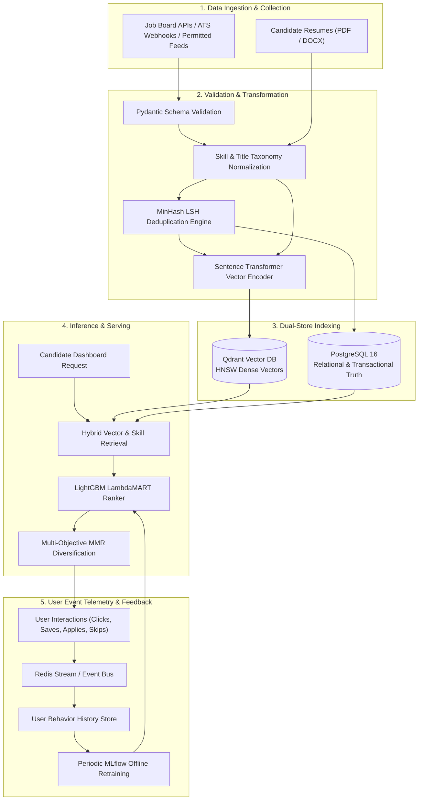

# 🔄 ANVESH: Data Lifecycle & Ingestion Flow Specification

## 1. End-to-End Data Lifecycle Overview



---

## 2. Ingestion & Transformation Subsystem

### 2.1. Ingestion Sources & Quality Gates
- **Allowed Ingestion**: Connects strictly to official APIs, ATS endpoints (Greenhouse, Lever, Workday webhooks), and structured RSS feeds with licensed access.
- **Strict Quality Gates**:
  1. Title length $\ge 3$ characters and $\le 100$ characters.
  2. Description length $\ge 200$ characters.
  3. Valid hiring company entity resolved.
  4. At least 2 verified required skills extracted.
  5. Valid date timestamp within acceptable window ($t \ge t_{\text{now}} - 60\text{ days}$).

### 2.2. Entity Resolution & Deduplication (MinHash LSH)

```mermaid
flowchart LR
    IncomingJob["Incoming Job Posting"] --> Shingling["3-Gram Shingling on Text"]
    Shingling --> MinHash["128 MinHash Signatures"]
    MinHash --> LSHIndex{"LSH Bucket Lookup"}
    LSHIndex -->|Match Found (Jaccard > 0.88)| MergeRecord["Merge Postings & Update Source Links"]
    LSHIndex -->|No Match| InsertNew["Insert New Canonical Job Record"]
    MergeRecord --> PG[("PostgreSQL")]
    InsertNew --> PG & QDR[("Qdrant")]
```

---

## 3. Vector Embedding & Indexing Pipeline

1. **Job Description Representation**:
   $$\text{Text}_{\text{job}} = \text{Title} \oplus \text{Company} \oplus \text{Required Skills} \oplus \text{Short Summary}$$
2. **Dense Encoder**: Encoded via `all-MiniLM-L6-v2` into a normalized unit vector:
   $$\mathbf{v} = \frac{\mathcal{E}(\text{Text}_{\text{job}})}{\|\mathcal{E}(\text{Text}_{\text{job}})\|} \in \mathbb{R}^{384}$$
3. **Qdrant Collection Schema (`job_embeddings_v1`)**:
   - Vector Size: 384
   - Distance Metric: `Cosine`
   - Payload Indexes: `job_id`, `company_id`, `experience_level`, `work_mode`, `posted_at`, `is_active`.

---

## 4. Closed-Loop Event Stream & Telemetry

When users interact with recommended jobs, events are captured asynchronously to refine ranking weights and prevent cold-start drift:

| Event Name | Trigger Condition | Target Payload | Implicit Weight ($y_i$) |
|---|---|---|---|
| `job_impression` | Job card rendered in candidate viewport | `user_id`, `job_id`, `rank_position`, `timestamp` | 0 |
| `job_click` | Candidate opens job detail drawer | `user_id`, `job_id`, `dwell_time_seconds` | 1 |
| `job_save` | Candidate bookmarks job to saved list | `user_id`, `job_id`, `folder_tag` | 2 |
| `job_apply_start` | Candidate clicks external application link | `user_id`, `job_id`, `referral_source` | 3 |
| `job_applied` | Candidate confirms completed application | `user_id`, `job_id`, `application_id` | 4 |
| `job_dismiss` | Candidate explicitly hides or rejects card | `user_id`, `job_id`, `reason_code` | -1 |
