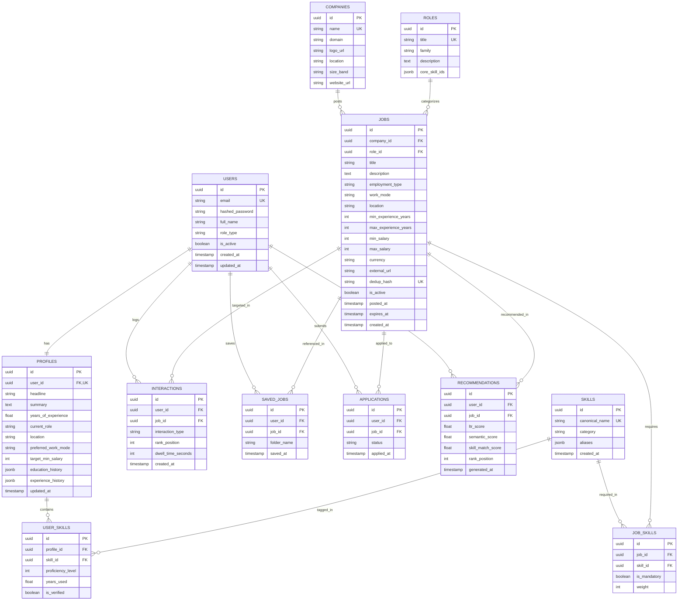

# 🗄️ ANVESH: Database Schema & Vector Storage Specification

## 1. Relational Database Entity-Relationship Diagram (PostgreSQL 16)



---

## 2. PostgreSQL Schema DDL (Relational Source of Truth)

```sql
-- Extensions
CREATE EXTENSION IF NOT EXISTS "uuid-ossp";
CREATE EXTENSION IF NOT EXISTS "pg_trgm";

-- 1. Users Table
CREATE TABLE users (
    id UUID PRIMARY KEY DEFAULT uuid_generate_v4(),
    email VARCHAR(255) UNIQUE NOT NULL,
    hashed_password VARCHAR(255) NOT NULL,
    full_name VARCHAR(255) NOT NULL,
    role_type VARCHAR(50) DEFAULT 'candidate',
    is_active BOOLEAN DEFAULT TRUE,
    created_at TIMESTAMP WITH TIME ZONE DEFAULT CURRENT_TIMESTAMP,
    updated_at TIMESTAMP WITH TIME ZONE DEFAULT CURRENT_TIMESTAMP
);

-- 2. Profiles Table
CREATE TABLE profiles (
    id UUID PRIMARY KEY DEFAULT uuid_generate_v4(),
    user_id UUID UNIQUE NOT NULL REFERENCES users(id) ON DELETE CASCADE,
    headline VARCHAR(255),
    summary TEXT,
    years_of_experience NUMERIC(4, 1) DEFAULT 0.0,
    current_role VARCHAR(150),
    location VARCHAR(150),
    preferred_work_mode VARCHAR(50) DEFAULT 'ANY', -- REMOTE, HYBRID, ONSITE, ANY
    target_min_salary INTEGER,
    education_history JSONB DEFAULT '[]'::jsonb,
    experience_history JSONB DEFAULT '[]'::jsonb,
    created_at TIMESTAMP WITH TIME ZONE DEFAULT CURRENT_TIMESTAMP,
    updated_at TIMESTAMP WITH TIME ZONE DEFAULT CURRENT_TIMESTAMP
);

-- 3. Canonical Skills Table
CREATE TABLE skills (
    id UUID PRIMARY KEY DEFAULT uuid_generate_v4(),
    canonical_name VARCHAR(150) UNIQUE NOT NULL,
    category VARCHAR(100) NOT NULL, -- e.g. Programming, Framework, Cloud, DevOps
    aliases JSONB DEFAULT '[]'::jsonb,
    created_at TIMESTAMP WITH TIME ZONE DEFAULT CURRENT_TIMESTAMP
);

-- 4. User Skills Join Table
CREATE TABLE user_skills (
    id UUID PRIMARY KEY DEFAULT uuid_generate_v4(),
    profile_id UUID NOT NULL REFERENCES profiles(id) ON DELETE CASCADE,
    skill_id UUID NOT NULL REFERENCES skills(id) ON DELETE RESTRICT,
    proficiency_level INTEGER CHECK (proficiency_level BETWEEN 1 AND 5),
    years_used NUMERIC(4, 1) DEFAULT 0.0,
    is_verified BOOLEAN DEFAULT FALSE,
    UNIQUE (profile_id, skill_id)
);

-- 5. Companies Table
CREATE TABLE companies (
    id UUID PRIMARY KEY DEFAULT uuid_generate_v4(),
    name VARCHAR(255) UNIQUE NOT NULL,
    domain VARCHAR(255),
    logo_url TEXT,
    location VARCHAR(150),
    size_band VARCHAR(50),
    website_url TEXT,
    created_at TIMESTAMP WITH TIME ZONE DEFAULT CURRENT_TIMESTAMP
);

-- 6. Canonical Roles Table
CREATE TABLE roles (
    id UUID PRIMARY KEY DEFAULT uuid_generate_v4(),
    title VARCHAR(150) UNIQUE NOT NULL,
    family VARCHAR(100) NOT NULL,
    description TEXT,
    core_skill_ids JSONB DEFAULT '[]'::jsonb
);

-- 7. Jobs Table
CREATE TABLE jobs (
    id UUID PRIMARY KEY DEFAULT uuid_generate_v4(),
    company_id UUID NOT NULL REFERENCES companies(id) ON DELETE CASCADE,
    role_id UUID REFERENCES roles(id) ON DELETE SET NULL,
    title VARCHAR(255) NOT NULL,
    description TEXT NOT NULL,
    employment_type VARCHAR(50) DEFAULT 'FULL_TIME',
    work_mode VARCHAR(50) DEFAULT 'REMOTE',
    location VARCHAR(150),
    min_experience_years INTEGER DEFAULT 0,
    max_experience_years INTEGER,
    min_salary INTEGER,
    max_salary INTEGER,
    currency VARCHAR(10) DEFAULT 'USD',
    external_url TEXT NOT NULL,
    dedup_hash VARCHAR(64) UNIQUE NOT NULL,
    is_active BOOLEAN DEFAULT TRUE,
    posted_at TIMESTAMP WITH TIME ZONE NOT NULL,
    expires_at TIMESTAMP WITH TIME ZONE,
    created_at TIMESTAMP WITH TIME ZONE DEFAULT CURRENT_TIMESTAMP
);

-- Indexes for Fast Filtering
CREATE INDEX idx_jobs_is_active ON jobs(is_active);
CREATE INDEX idx_jobs_posted_at ON jobs(posted_at DESC);
CREATE INDEX idx_jobs_work_mode ON jobs(work_mode);
CREATE INDEX idx_jobs_experience ON jobs(min_experience_years, max_experience_years);

-- 8. Job Skills Join Table
CREATE TABLE job_skills (
    id UUID PRIMARY KEY DEFAULT uuid_generate_v4(),
    job_id UUID NOT NULL REFERENCES jobs(id) ON DELETE CASCADE,
    skill_id UUID NOT NULL REFERENCES skills(id) ON DELETE RESTRICT,
    is_mandatory BOOLEAN DEFAULT TRUE,
    weight NUMERIC(3, 2) DEFAULT 1.0,
    UNIQUE (job_id, skill_id)
);

-- 9. Interactions / Telemetry Table
CREATE TABLE interactions (
    id UUID PRIMARY KEY DEFAULT uuid_generate_v4(),
    user_id UUID NOT NULL REFERENCES users(id) ON DELETE CASCADE,
    job_id UUID NOT NULL REFERENCES jobs(id) ON DELETE CASCADE,
    interaction_type VARCHAR(50) NOT NULL, -- IMPRESSION, CLICK, SAVE, APPLY, DISMISS
    rank_position INTEGER,
    dwell_time_seconds INTEGER DEFAULT 0,
    created_at TIMESTAMP WITH TIME ZONE DEFAULT CURRENT_TIMESTAMP
);

CREATE INDEX idx_interactions_user_job ON interactions(user_id, job_id);
CREATE INDEX idx_interactions_created_at ON interactions(created_at DESC);
```

---

## 3. Qdrant Vector DB Collection Specs

### 3.1. Collection: `job_embeddings_v1`
- **Dimension**: 384
- **Distance Metric**: `Cosine`
- **HNSW Parameters**: `m=16`, `ef_construct=100`, `full_scan_threshold=10000`
- **Payload Schema**:
  ```json
  {
    "job_id": "uuid-string",
    "company_id": "uuid-string",
    "role_id": "uuid-string",
    "work_mode": "REMOTE | HYBRID | ONSITE",
    "min_experience_years": 3,
    "max_experience_years": 6,
    "min_salary": 120000,
    "is_active": true,
    "posted_at": 1708450000,
    "required_skill_ids": ["uuid-1", "uuid-2"]
  }
  ```

### 3.2. Collection: `profile_embeddings_v1`
- **Dimension**: 384
- **Distance Metric**: `Cosine`
- **Payload Schema**:
  ```json
  {
    "user_id": "uuid-string",
    "years_of_experience": 4.5,
    "current_role": "Backend Engineer",
    "skill_ids": ["uuid-1", "uuid-3", "uuid-7"],
    "updated_at": 1708450000
  }
  ```

### 3.3. Collection: `role_embeddings_v1`
- **Dimension**: 384
- **Distance Metric**: `Cosine`
- **Payload Schema**:
  ```json
  {
    "role_id": "uuid-string",
    "title": "Machine Learning Engineer",
    "family": "Artificial Intelligence",
    "core_skill_ids": ["uuid-10", "uuid-12"]
  }
  ```

---

## 4. Redis Key Topology & Cache Expiration Strategy

| Key Pattern | Data Structure | TTL | Purpose |
|---|---|---|---|
| `session:{token}` | String (JSON) | 24 Hours | Authenticated user session and RBAC claims |
| `profile_vec:{user_id}` | Binary Blob (float32 array) | 1 Hour | Cached dense vector for fast recommendation cycles |
| `rec_cache:{user_id}:{hash}` | List (JSON) | 15 Minutes | Cached Top-20 recommendation response |
| `rate_limit:{user_id}:{endpoint}` | String (Counter) | 1 Minute | Sliding window API rate limiter |
| `stream:user_events` | Redis Stream | 7 Days | Telemetry event log for asynchronous ML worker consumption |
