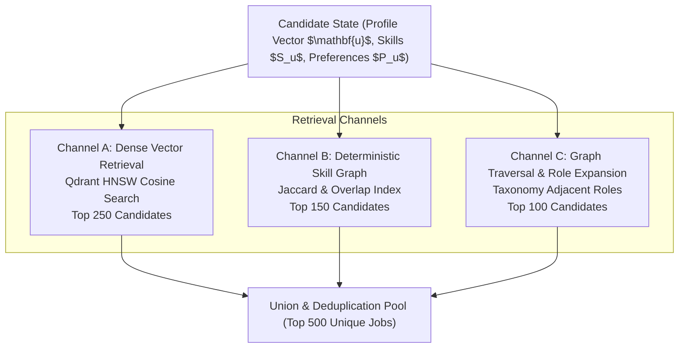
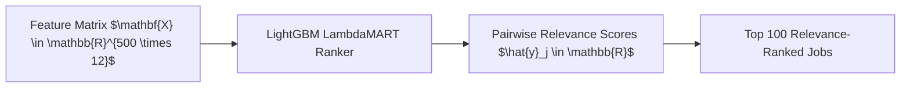

# 🎯 ANVESH: Recommendation & Ranking Pipeline Specification

## 1. Problem Formulation

Let $\mathcal{U}$ be the set of candidates, and $\mathcal{J}$ be the global catalog of indexed active job opportunities ($|\mathcal{J}| \approx 10^5$).
For a candidate $u \in \mathcal{U}$ characterized by structured skills $S_u$, professional experience $E_u$, preferences $P_u$, and dense profile vector $\mathbf{u} \in \mathbb{R}^d$, the objective is to generate an ordered list of top-$K$ job postings:

$$\mathcal{R}_K(u) = [j_1, j_2, \dots, j_K] \subset \mathcal{J}, \quad K = 20$$

such that the returned list maximizes relevance (NDCG@10), intra-list diversity (Gini Index), catalog coverage, and temporal freshness, while minimizing latency:

$$\text{Latency}(\mathcal{R}_K(u)) \le 50\text{ ms}$$

---

## 2. Multi-Stage Pipeline Overview

```
[ All Jobs in DB (100,000+) ]
              │
              ▼  (Stage 1: Hybrid Retrieval)
    [ Candidate Pool (500) ]
              │
              ▼  (Stage 2: Feature Engineering)
    [ Feature Matrix (500 x 12) ]
              │
              ▼  (Stage 3: LightGBM LambdaMART)
    [ Top-Ranked Pool (100) ]
              │
              ▼  (Stage 4: Multi-Objective MMR Re-Ranking)
    [ Final Recommendations (Top 20) ]
```

---

## 3. Stage 1: Hybrid Candidate Retrieval (100,000 → 500)

Candidate generation pulls from three complementary channels to prevent false negatives:



### 3.1. Channel A: Dense Vector Semantic Retrieval
- **Vector Space**: 384-dimensional embeddings generated via `sentence-transformers/all-MiniLM-L6-v2`.
- **Similarity Metric**:
  $$\text{Sim}_{\text{cosine}}(\mathbf{u}, \mathbf{v}_j) = \frac{\mathbf{u} \cdot \mathbf{v}_j}{\|\mathbf{u}\| \|\mathbf{v}_j\|}$$
- **Qdrant Filter Constraints**: Ingested with payload filters (`is_active == true`, `min_exp <= user_exp + 3`, `work_mode IN user_preferred_modes`).
- **Target Size**: Returns top 250 candidates.

### 3.2. Channel B: Deterministic Skill Graph Retrieval
- **Skill Overlap Score**:
  $$\text{Overlap}(S_u, S_j^{\text{req}}) = \frac{|S_u \cap S_j^{\text{req}}|}{|S_j^{\text{req}}|}$$
- Employs an inverted in-memory index of canonical skill IDs to quickly match jobs sharing at least 60% of mandatory required skills.
- **Target Size**: Returns top 150 candidates.

### 3.3. Channel C: Role Taxonomy Expansion
- Traverses the ontological skill graph (`roles.json` / `skills.json`) to fetch postings for adjacent bridge roles.
- **Target Size**: Returns top 100 candidates.

---

## 4. Stage 2: Feature Engineering & Feature Store

Each candidate job $j \in \mathcal{C}_{\text{pool}}$ ($|\mathcal{C}_{\text{pool}}| = 500$) is transformed into a dense feature vector $\mathbf{x}_{u,j} \in \mathbb{R}^{12}$:

| Feature ID | Feature Name | Description | Mathematical Formulation | Value Range |
|---|---|---|---|---|
| $f_1$ | `semantic_sim` | Cosine similarity between user and job dense embeddings | $\cos(\mathbf{u}, \mathbf{v}_j)$ | $[-1.0, 1.0]$ |
| $f_2$ | `req_skill_match` | Percentage of mandatory required skills satisfied | $\frac{\|S_u \cap S_j^{\text{req}}\|}{\|S_j^{\text{req}}\|}$ | $[0.0, 1.0]$ |
| $f_3$ | `pref_skill_match` | Percentage of optional/preferred skills satisfied | $\frac{\|S_u \cap S_j^{\text{pref}}\|}{\|S_j^{\text{pref}}\|}$ | $[0.0, 1.0]$ |
| $f_4$ | `missing_skill_count`| Absolute count of mandatory skills missing | $\|S_j^{\text{req}} \setminus S_u\|$ | $[0, \infty)$ |
| $f_5$ | `exp_delta` | Experience disparity between job requirement and user years | $\max(0, E_j^{\text{min}} - E_u)$ | $[0, 20]$ |
| $f_6$ | `exp_overqual` | Candidate overqualification buffer | $\max(0, E_u - E_j^{\text{max}})$ | $[0, 20]$ |
| $f_7$ | `work_mode_match` | Binary match for Remote / Hybrid / Onsite preference | $\mathbb{I}(M_j \in P_u^{\text{mode}})$ | $\{0, 1\}$ |
| $f_8$ | `location_dist_score`| Geodesic inverse distance penalty (for non-remote roles) | $\frac{1}{1 + 0.01 \cdot d(L_u, L_j)}$ | $[0.0, 1.0]$ |
| $f_9$ | `freshness_score` | Exponential decay based on days since posting | $\exp\left(-\frac{\ln(2) \cdot \Delta t}{30}\right)$ | $(0.0, 1.0]$ |
| $f_{10}$ | `company_affinity` | Historical CTR / save interaction weight for company | $\frac{\text{clicks}_{u, \text{comp}} + 1}{\text{impressions}_{u, \text{comp}} + 10}$ | $[0.0, 1.0]$ |
| $f_{11}$ | `role_affinity` | Historical CTR / save interaction weight for role family | $\frac{\text{clicks}_{u, \text{role}} + 1}{\text{impressions}_{u, \text{role}} + 10}$ | $[0.0, 1.0]$ |
| $f_{12}$ | `salary_alignment` | Overlap of candidate expected salary with job band | $\mathbb{I}(\text{Sal}_u \cap \text{Sal}_j \neq \emptyset)$ | $\{0, 1\}$ |

---

## 5. Stage 3: Learning-to-Rank (LTR) Machine Learning Engine



### 5.1. LightGBM LambdaMART Formulation
The scoring model utilizes gradient boosted decision trees trained with the **LambdaMART** algorithm optimizing directly for **Normalized Discounted Cumulative Gain (NDCG)**:

$$\text{NDCG}@K = \frac{\text{DCG}@K}{\text{IDCG}@K}, \quad \text{DCG}@K = \sum_{i=1}^K \frac{2^{y_i} - 1}{\log_2(i + 1)}$$

where $y_i \in \{0, 1, 2, 3, 4\}$ denotes explicit interaction relevance levels:
- `0`: Impression without click
- `1`: Click / View details
- `2`: Saved to favorites
- `3`: Started application
- `4`: Submitted application / Recruiter contact

### 5.2. Pairwise Lambda Gradient
For item pair $(i, j)$ where $y_i > y_j$:

$$\lambda_{ij} = \frac{-\sigma}{1 + e^{\sigma (\hat{y}_i - \hat{y}_j)}} |\Delta \text{NDCG}_{ij}|$$

where $|\Delta \text{NDCG}_{ij}|$ is the change in NDCG resulting from swapping items $i$ and $j$ in the permutation.

---

## 6. Stage 4: Multi-Objective Re-Ranking & Diversification (100 → 20)

Pure relevance ranking creates filter bubbles (e.g., all 20 jobs from the same company or identical title). ANVESH applies **Maximal Marginal Relevance (MMR)** with freshness and exploration terms:

### 6.1. Optimization Equation

Let $R$ be the pool of top 100 ranked candidates, and $S$ be the selected recommendation set ($|S| < 20$). The next selected item $j^*$ is chosen by:

$$j^* = \arg\max_{j \in R \setminus S} \left[ \alpha \cdot \hat{y}_j - (1 - \alpha) \max_{s \in S} \text{Sim}_{\text{entity}}(j, s) + \beta \cdot \text{Freshness}(j) + \gamma \cdot \text{Explore}(j) \right]$$

### 6.2. Parameter Tuning
- $\alpha = 0.65$: Relevance trade-off parameter.
- $(1 - \alpha) = 0.35$: Diversity penalty weight.
- $\beta = 0.15$: Freshness boost weight.
- $\gamma = 0.05$: Serendipity / Exploration epsilon.
- $\text{Sim}_{\text{entity}}(j, s) = 0.5 \cdot \mathbb{I}(\text{Comp}_j = \text{Comp}_s) + 0.5 \cdot \cos(\mathbf{v}_j, \mathbf{v}_s)$: Prevents multi-listing clutter from the same employer.

---

## 7. Latency Budget & Benchmark SLA

| Stage | Operation | Max Latency Budget | Execution Type |
|---|---|---|---|
| **Stage 1** | Qdrant HNSW Vector Search + Inverted Skill Match | $12\text{ ms}$ | Async Parallel I/O |
| **Stage 2** | Feature Generation & Extraction | $8\text{ ms}$ | Vectorized NumPy / Pandas |
| **Stage 3** | LightGBM Batch Inference (500 items) | $5\text{ ms}$ | C++ Native Tree Traversal |
| **Stage 4** | MMR Multi-Objective Diversification (Top 20) | $3\text{ ms}$ | Greedy Algorithmic Loop |
| **Stage 5** | Database Hydration & API Serialization | $10\text{ ms}$ | Async SQLAlchemy |
| **Total** | **End-to-End Recommendation API** | **$< 40\text{ ms}$** | **Passes SLA ($< 50\text{ ms}$)** |
