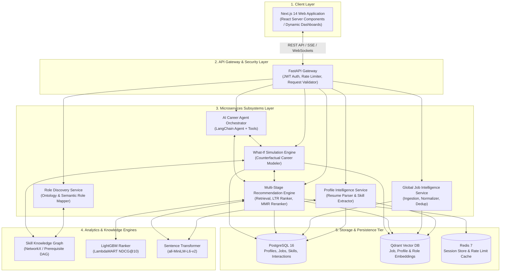
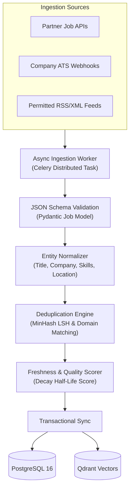
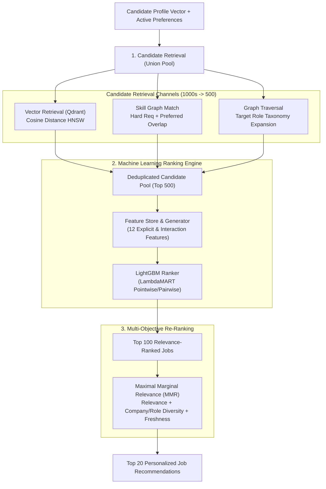
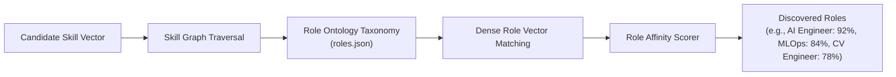
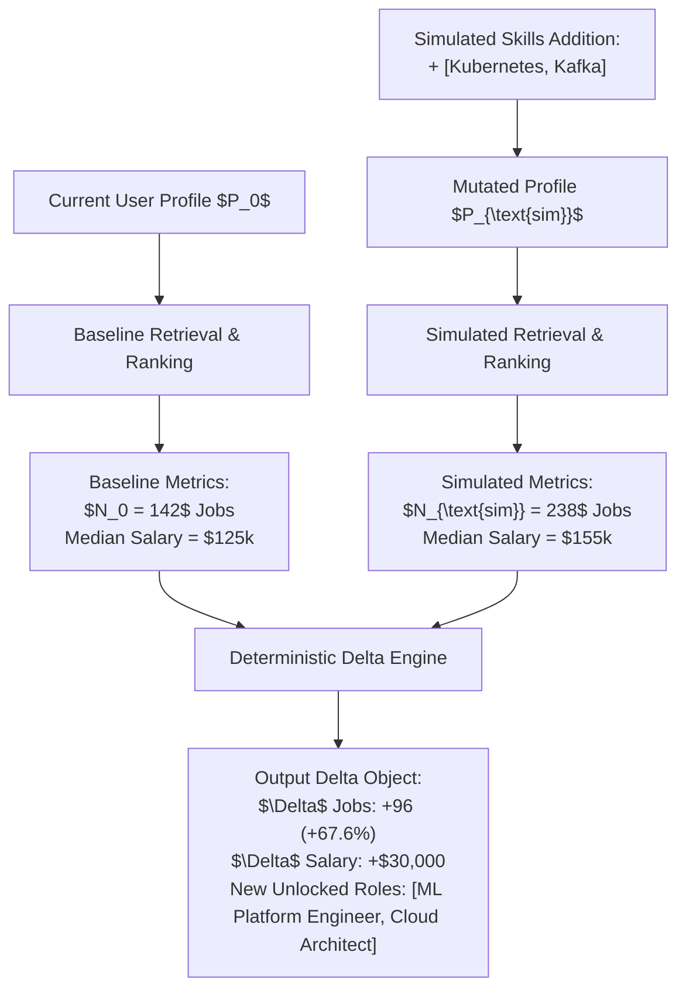
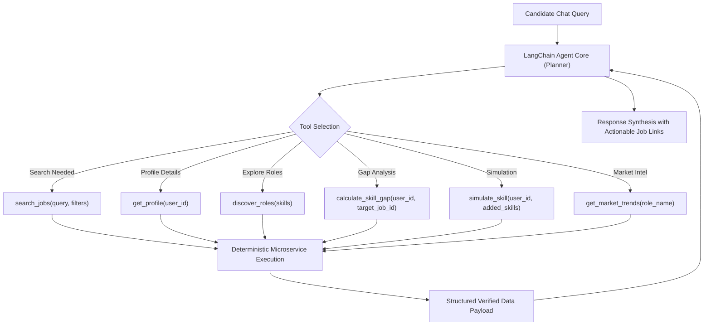

# 🏗️ ANVESH: System Design & Architecture Specification

## 1. Executive Summary

**ANVESH** is a high-throughput, AI-powered global career discovery and multi-stage recommendation ecosystem. The platform addresses fundamental shortcomings in modern talent discovery platforms:
1. **Semantic Blindness**: Keyword matching fails to understand transferable skills and adjacent domain knowledge.
2. **Black-box Hallucinations**: Pure LLM-based solutions hallucinate non-existent jobs or fabricate match percentages without reproducible empirical grounding.
3. **Passive Search Paradigms**: Current platforms expect users to already know what role title to search for, failing candidates exploring career transitions.

ANVESH solves this through a decoupled, multi-stage recommendation engine, an ontological skill knowledge graph, a counterfactual What-If simulation engine, and an autonomous AI agent constrained by deterministic tool calls.

---

## 2. End-to-End System Topology

---

## 3. Subsystem Deep Dives

### 3.1. Profile Intelligence Service (PIS)

The Profile Intelligence Service ingests raw candidate resumes and converts unstructured textual narratives into structured candidate intelligence representations.

```mermaid
flowchart LR
    RawDoc["Raw Resume<br/>(PDF / DOCX / TXT)"] --> TextExtract["Text & Section Extractor<br/>(pdfminer / python-docx)"]
    TextExtract --> NER["Named Entity Recognizer<br/>(spaCy NER + Rule Regex)"]
    NER --> Norm["Skill Canonicalizer<br/>(Taxonomy Mapper)"]
    Norm --> ExpModel["Experience & Trajectory Extractor"]
    ExpModel --> ProfileObj["Structured Candidate Profile JSON"]
    ProfileObj --> VectorEncoder["Profile Dense Encoder<br/>(all-MiniLM-L6-v2)"]
    VectorEncoder --> DBStore[("PostgreSQL & Qdrant")]
```

#### Key Responsibilities:
1. **Section Segmentation**: Identifies and separates *Work Experience*, *Education*, *Projects*, *Skills*, and *Certifications*.
2. **Skill Normalization**: Employs an exact-match and phonetic/Levenshtein matching against canonical skill IDs in `skills.json`.
3. **Experience Calculation**: Accurately computes total years of professional experience, seniority level (Junior, Mid, Senior, Lead, Staff), and recency of each skill.
4. **Dense Vector Generation**: Produces a unified 384-dimensional profile vector encoding both explicit skills and implicit career context.

---

### 3.2. Global Job Intelligence Subsystem (JIS)

The Global Job Intelligence Subsystem continuously ingests, validates, normalizes, deduplicates, and indexes job postings from permitted feeds, ATS integrations, and partner APIs.

#### Deduplication & Freshness Rules:
- **MinHash LSH Deduplication**: Hashes job title + company domain + normalized description n-grams. When Jaccard similarity $> 0.88$ with an existing listing within 14 days, the record is merged rather than duplicated.
- **Freshness Score**: Computed as:
  $$\text{Freshness}(t) = \exp\left(-\frac{\ln(2) \cdot (t_{\text{current}} - t_{\text{posted}})}{\tau_{1/2}}\right)$$
  where $\tau_{1/2} = 30\text{ days}$. Jobs older than 60 days are demoted or archived.

---

### 3.3. Multi-Stage Recommendation Subsystem (REC)

The recommendation engine executes a 4-stage retrieval, ranking, and diversification pipeline:

---

### 3.4. Role Discovery Subsystem (RDS)

When a candidate does not have a predefined target role or is considering pivot opportunities, the Role Discovery Subsystem compares the candidate's skill graph against global role ontologies.

---

### 3.5. What-If Counterfactual Simulation Engine (WIE)

The What-If engine answers real-world candidate queries: *"If I invest 3 months to learn Kubernetes and Apache Kafka, how many new jobs unlock, and what is the expected market compensation shift?"*

---

### 3.6. AI Career Agent Subsystem (AGT)

The AI Career Agent provides natural-language guidance without sacrificing factual truth. It follows a strict **Tool-Augmented Reasoning Loop**.

---

## 4. Cross-Cutting Architectural Concerns

### 4.1. Security & Authentication
- Stateless JWT-based Bearer authentication (RS256 signed).
- Role-based Access Control (RBAC): `Candidate`, `Recruiter`, `Admin`, `ServiceWorker`.
- Strict input sanitization and Pydantic validation on all endpoints.

### 4.2. Caching & Performance
- Redis caching for candidate profile embeddings and role taxonomy vectors.
- TTL-based caching for frequent recommendation queries ($TTL = 15\text{ mins}$).
- Asynchronous non-blocking database queries via `asyncpg` and `SQLAlchemy 2.0 AsyncSession`.

### 4.3. Observability & Telemetry
- Prometheus metrics endpoint (`/metrics`) exposing:
  - `recommendation_latency_seconds` (Histogram)
  - `retrieval_candidate_count` (Histogram)
  - `job_ingestion_total` (Counter)
  - `what_if_simulations_total` (Counter)
- Structured JSON logging with correlation IDs on all requests.
